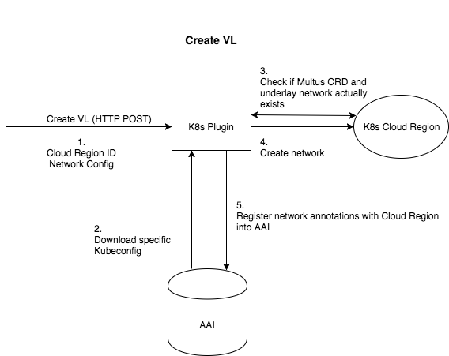

<!-- Copyright 2018 Intel Corporation.
Licensed under the Apache License, Version 2.0 (the "License");
you may not use this file except in compliance with the License.
You may obtain a copy of the License at
    http://www.apache.org/licenses/LICENSE-2.0
Unless required by applicable law or agreed to in writing, software
distributed under the License is distributed on an "AS IS" BASIS,
WITHOUT WARRANTIES OR CONDITIONS OF ANY KIND, either express or implied.
See the License for the specific language governing permissions and
limitations under the License. -->

# MultiCloud-k8-plugin

MultiCloud Kubernetes plugin for ONAP multicloud.

# Installation

Requirements:
* Go 1.10
* Dep

Steps:

* Clone repo in GOPATH src:
    * `cd $GOPATH/src && git clone https://git.onap.org/multicloud/k8s`

* Run unit tests:
    *  `make build`

* Compile to build Binary:
    * `make deploy`

# Archietecture

Create Virtual Network Function

Create Virtual Link

