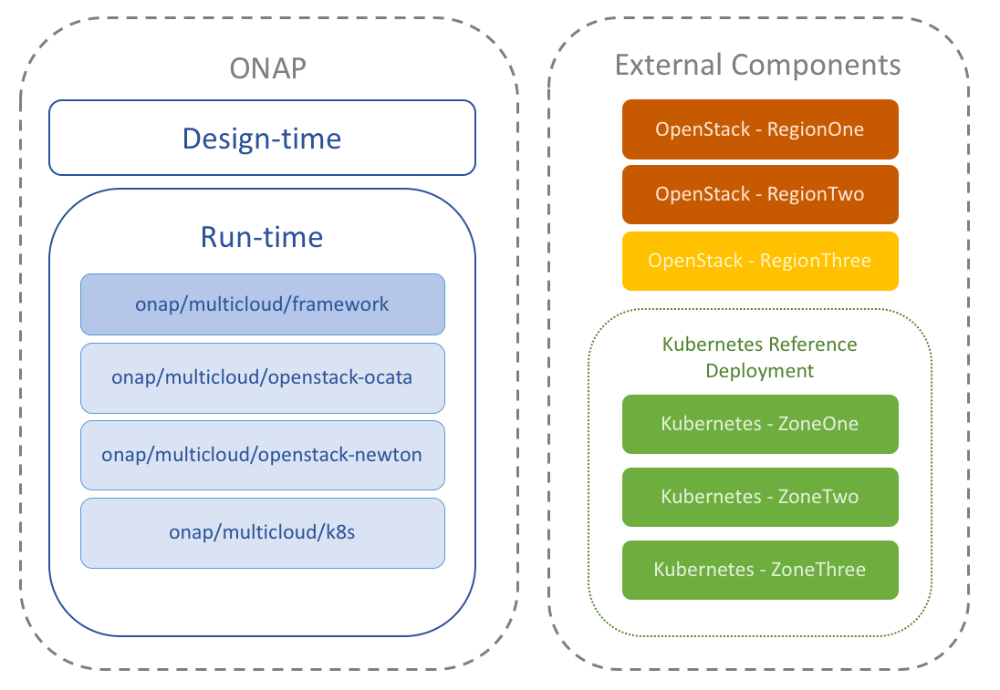

# Kubernetes Deployment

## Summary

This project offers a means for deploying a Kubernetes cluster
that satisfies the requirements of [ONAP multicloud/k8s plugin][1]. Its
ansible playbooks allow to provision a deployment on Virtual Machines and on Baremetal.

# Components

| Name           | Description                                   | Source                            | Status |
|:--------------:|:----------------------------------------------|:----------------------------------|:------:|
| Kubernetes     | Base Kubernetes deployment                    | [kubespray][2]                    | Done   |
| ovn4nfv        | Integrates Opensource Virtual Networking      | [configure-ovn4nfv.yml][3]        | Tested |
| Virtlet        | Allows to run VMs                             | [configure-virtlet.yml][4]        | Tested |
| Multus         | Provides Multiple Network support in a pod    | [configure-multus.yml][5]         | Tested |
| NFD            | Node feature discovery                        | [configure-nfd.yml][6]            | Tested |
| Istio          | Service Mesh platform                         | [configure-istio.yml][7]          | Tested |

## Deployment

The [installer](installer.sh) bash script contains the minimal
Ubuntu instructions required for running this project.

## License

Apache-2.0

[1]: https://git.onap.org/multicloud/k8s
[2]: https://github.com/kubernetes-incubator/kubespray
[3]: deployment_infra/playbooks/configure-ovn4nfv.yml
[4]: deployment_infra/playbooks/configure-virtlet.yml
[5]: deployment_infra/playbooks/configure-multus.yml
[6]: deployment_infra/playbooks/configure-nfd.yml
[7]: deployment_infra/playbooks/configure-istio.yml
