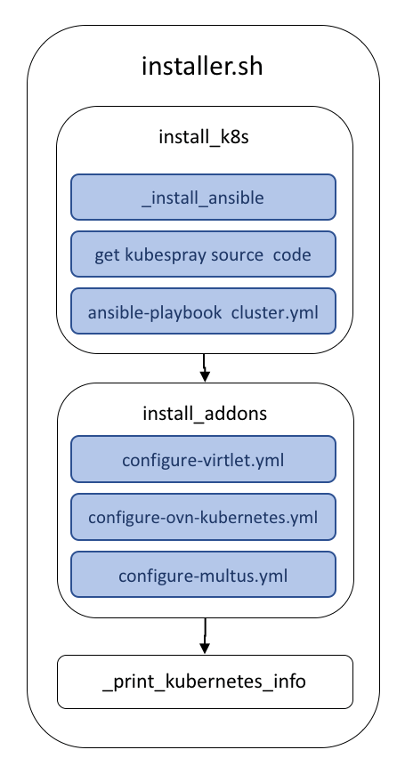

# Kubernetes Deployment

## Summary

This project offers a means for deploying a Kubernetes cluster
that satisfies the requirements of [ONAP multicloud/k8s plugin][1]. Its
ansible playbooks allow to provision a deployment on Baremetal. 

## Deployment

The [installer](installer.sh) bash script contains the minimal
Ubuntu instructions required for running this project.

## License

Apache-2.0

[1]: https://git.onap.org/multicloud/k8s
