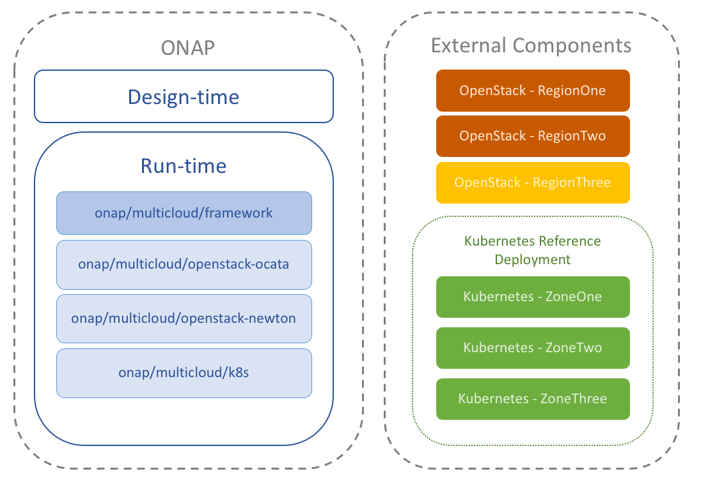

# Kubernetes Deployment

## Summary

This project offers a means for deploying a Kubernetes cluster
that satisfies the requirements of [ONAP multicloud/k8s plugin][1]. Its
ansible playbooks allow to provision a deployment on Virtual Machines.

## Deployment

The [installer](installer.sh) bash script contains the minimal
Ubuntu instructions required for running this project.

### Virtual Machines

This project uses [Vagrant tool][2] for provisioning Virtual Machines
automatically. The [setup](setup.sh) bash script contains the
Linux instructions to install dependencies and plugins required for
its usage. This script supports two Virtualization technologies
(Libvirt and VirtualBox).

    $ ./setup.sh -p libvirt

Once Vagrant is installed, it's possible to provision a cluster using
the following instructions:

    $ vagrant up && vagrant up installer

## License

Apache-2.0

[1]: https://git.onap.org/multicloud/k8s
[2]: https://www.vagrantup.com/
