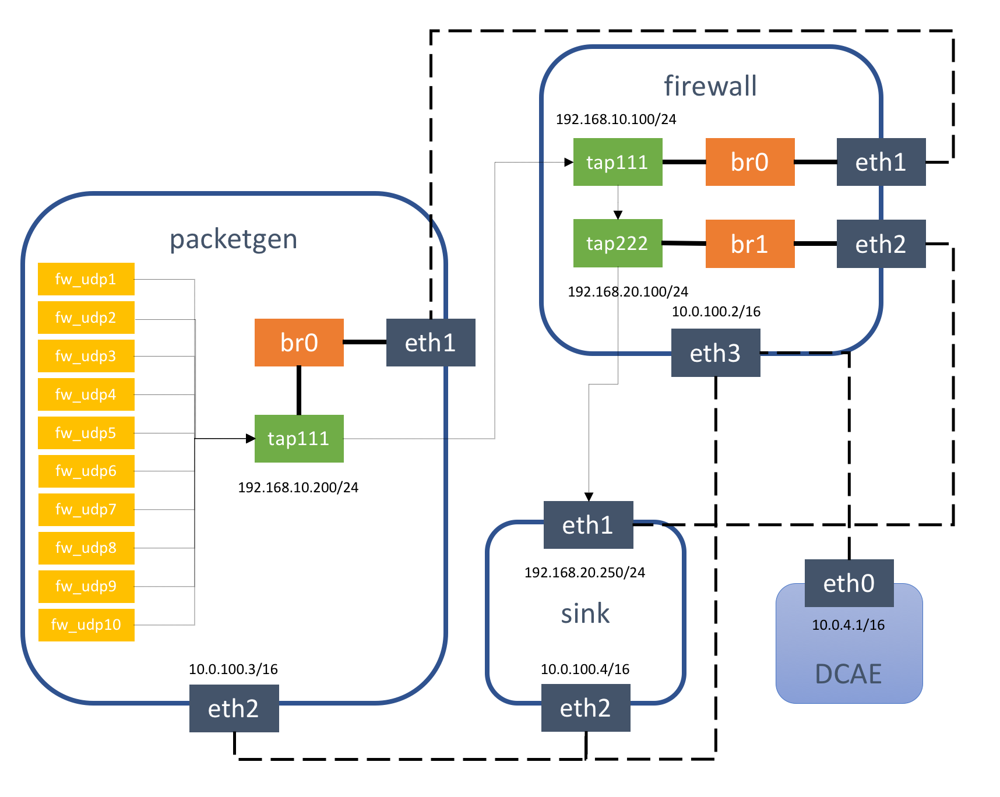

# vFirewall ONAP Use Case

This use case is composed of three virtual functions (VFs) running in
separate Ubuntu Virtual Machines:

  * [Packet generator][1]: Sends packets to the packet sink through the
firewall. This includes a script that periodically generates different
volumes of traffic.
  * [Firewall][2]: Reports the volume of traffic passing though to the
ONAP DCAE collector.
  * [Traffic sink][3]: Displays the traffic volume that lands at the sink
VM using the link http://192.168.20.250:667 through your browser
and enable automatic page refresh by clicking the "Off" button. You
can see the traffic volume in the charts.



## Adjust packet generator:

The packet generator contains 10 streams: fw\_udp1, fw\_udp2,
fw\_udp3, . . . , fw\_udp10. Each stream generates 100 packets every
10 seconds. The  */opt/run\_traffic\_fw\_demo.sh* script on the packet
generator VM starts automatically and alternates high traffic (i.e.
10 active streams at the same time) and low traffic (1 active stream)
every 5 minutes.

To enable a stream, include `{"id":"fw_udp1", "is-enabled":"true"}`
in the *pg-stream* bracket. 

To adjust the traffic volume produced by the packet generator, run the
following command in a shell:

```
    curl -X PUT \
         -H "Authorization: Basic YWRtaW46YWRtaW4=" \
         -H "Content-Type: application/json" \
         -H "Cache-Control: no-cache" \
         -d '{"pg-streams":{"pg-stream": [{"id":"fw_udp1", "is-enabled":"true"},{"id":"fw_udp2", "is-enabled":"true"},{"id":"fw_udp3", "is-enabled":"true"},{"id":"fw_udp4", "is-enabled":"true"},{"id":"fw_udp5", "is-enabled":"true"}]}}' \
        "http://192.168.10.200:8183/restconf/config/sample-plugin:sample-plugin/pg-streams"
```

The command above enables 5 streams.

## License

Apache-2.0

[1]: packetgen
[2]: firewall
[3]: sink
